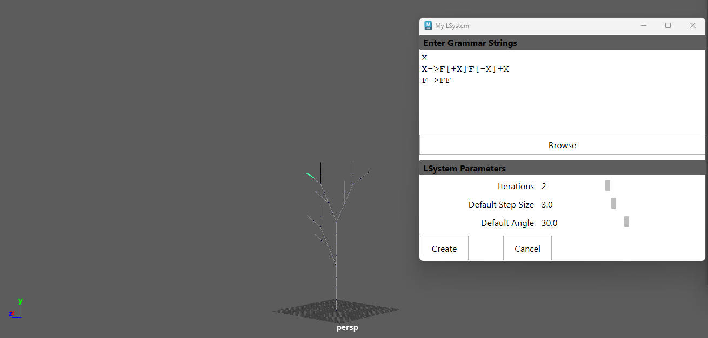
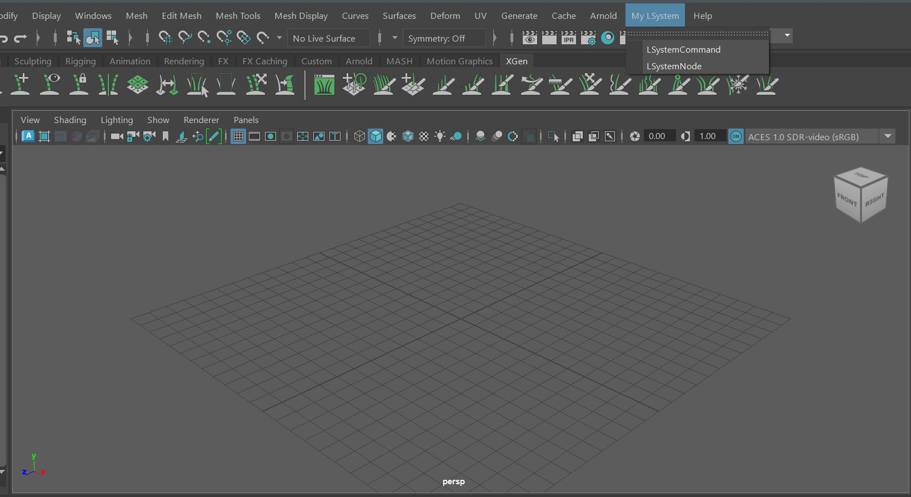
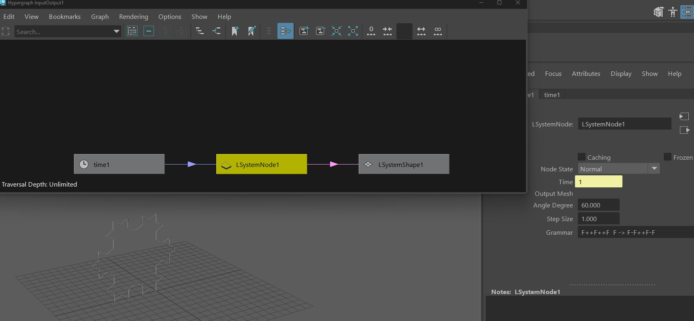
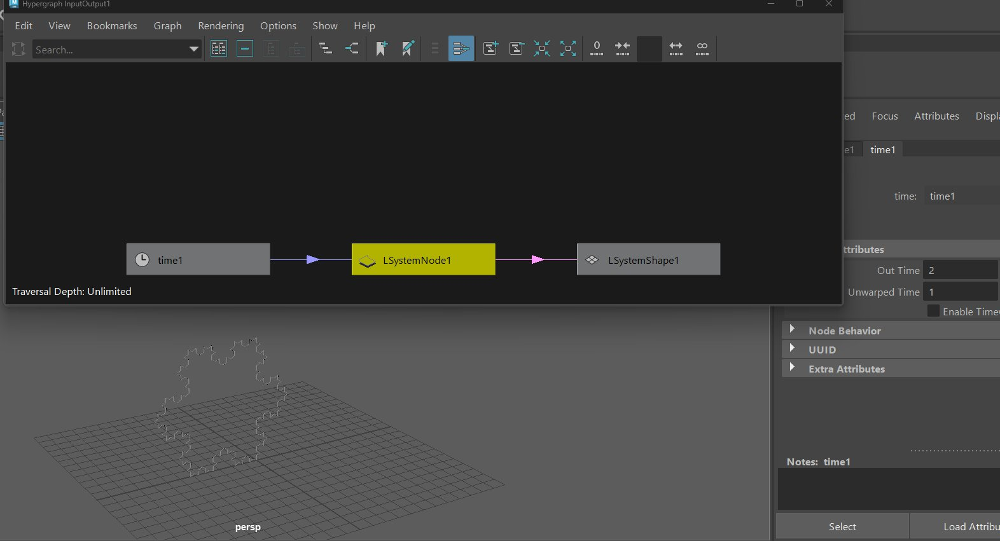
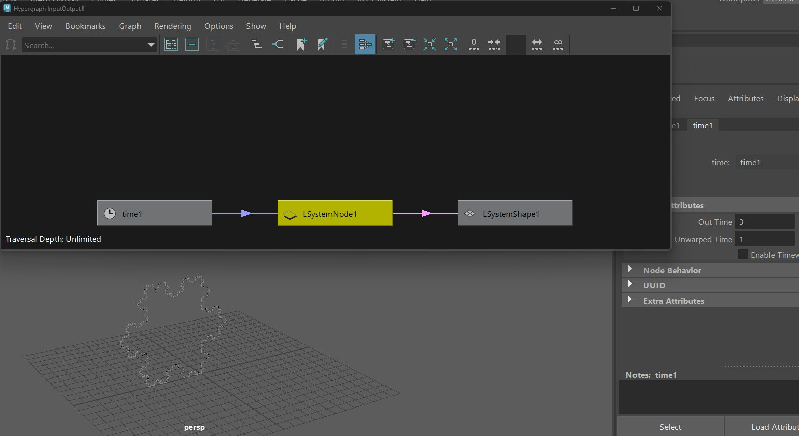

Disclaimer: I have implemented all functionalities
# 2.1
Sucessfully compiled
# 2.2 Create Lsystem Command

## 2.2ab Using Command Line LSystem Command
Below is my implementation of a static L-System

Commands for testing is as below
```
LSystemCmd -i 2 -a 30 -g "F\n F -> FF + [+F-F-F] - [-F+F+F]" -ss 3 
```

Capture below:


## 2.2 c An UI Based interface
Capture below:

I have also implemented the optional GUI Scroll fields


## 2.3
### GUI
I have created a GUI based LSystem Management


### Hypergrpah node and output according to time (Dynamic)
- When Time is 1

- When Time is 2

- When Time is 3


